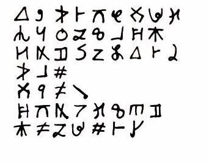

# Project Orca

This was my BYU-I Senior Project, completed in 2018. The goal of the project was to implement an OCR that would read an alphabet I made-up of about 30 unique characters.

I created a training set of data by writing out the symbols myself in a [Rocketbook](https://getrocketbook.com/) (a notebook with pages designed to be scanned intodata/rty.jpg google drive with an app) a few times, and then getting some additional training data by having friends copy the symbols themselves, and making the images black/white.

I would then reduce the images to binary vectors and do [dimensionality reduction](https://en.wikipedia.org/wiki/Dimensionality_reduction) to produce a handful of [Eigenfaces](https://en.wikipedia.org/wiki/Eigenface) for each symbol, which was the ML part of the project. To categorize an image of a character, the program would mathematically project it onto the eigenfaces for each character, and then compare the result to the actual image. The closest result would be chosen as the winner.

# Why this project?

I love coding, but I don't always have a computer on me. I also love the aesthetic and feeling of handwriting. There were several times when I wished that I could do some actual coding using a pen and paper.

This project's main vision was creating a language of symbols that would be easier for the computer to recognize than the Latin alphabet or the symbols present on the keyboard. One could then write using these symbols (or a mix of these symbols and English characters) to create a hand-written script. This script would be scanned with a mobile app, which would produce actual code and be able to verify that the code worked as expected.

Perhaps not the most practical product or dream, but I liked it. It was also an excuse to exercise some new skills: Machine learning, Haskell, and linear algebra.

# Post Mortem

If I recall correctly, results accuracy was around 80%, even after limiting the alphabet to a smaller subset of 26 characters. This was pretty disappointing to me, but given the limited timeframe and dataset. Besides, the main goal was to stretch my skills and learn something new through application, and that was certainly achieved.

If I could do it again, I would have a much larger training set on fewer outputs. I made the alphabet too large to ask others to produce several copies, and for me to manually enter into the training data.

I also realized much later that I had accidentally given my friends an older draft of the language to copy, where a few of the symbols had been changed. This meant that some of the characters actually had two differnt symbols assigned to them in the data.
